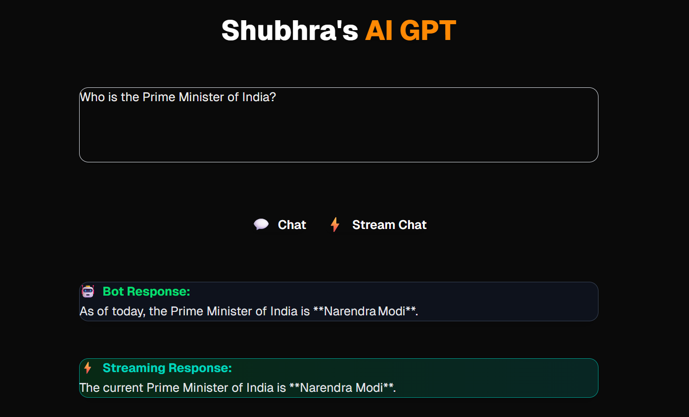

# 🤖 Shubhra's AI GPT – Next.js Chatbot

This is a **full-stack AI chatbot** built with **Next.js 13 (App Router)** and powered by **OpenRouter’s GPT models**.  
It supports both **normal chat responses** and **real-time streaming responses** for an interactive user experience.  

---

## 📸 Demo
Here’s a preview of the chatbot UI:

  

## 🚀 Features

- ✅ Built with **Next.js 13 App Router**
- ✅ **Serverless API routes** for chat & streaming responses
- ✅ **Streaming AI responses** (real-time typing effect)
- ✅ Styled with **TailwindCSS** for modern UI
- ✅ Error handling & graceful fallback
- ✅ Clean, responsive, and minimalistic design

---

## 🛠️ Tech Stack

- **Frontend**: React + Next.js 13  
- **Styling**: TailwindCSS  
- **Backend**: Next.js API Routes  
- **AI API**: OpenAI

